# Python VPN System - Visual Diagrams

## System Architecture Overview

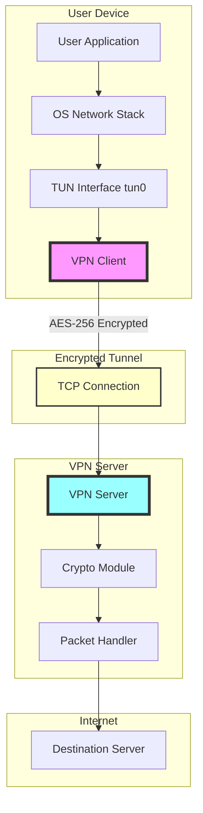

## Connection Flow Sequence

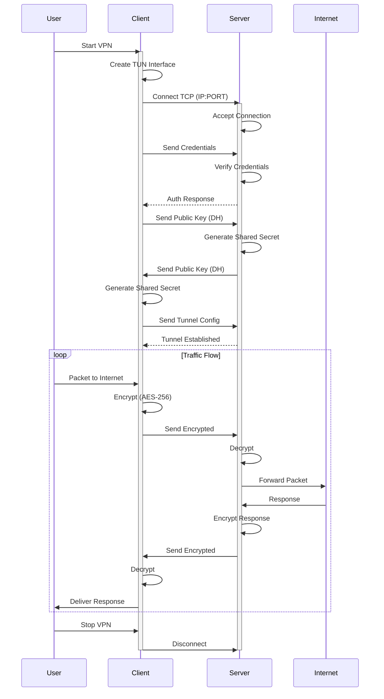

## VPN Server Architecture

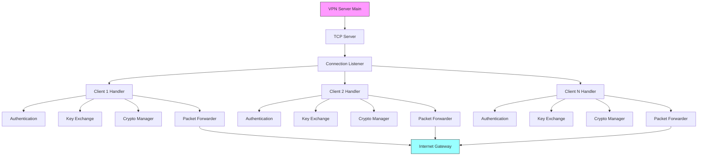

## VPN Client Architecture

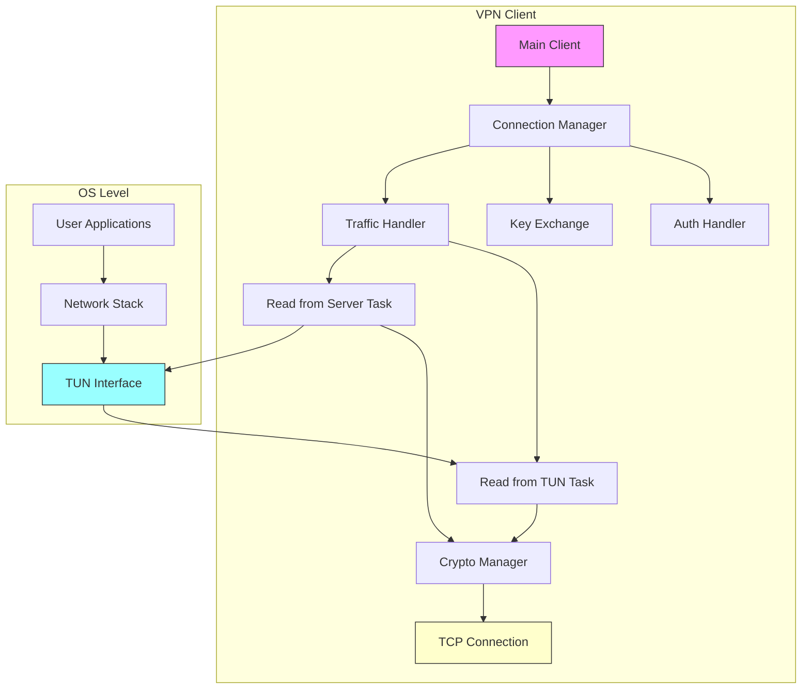

## Encryption/Decryption Flow

```mermaid
graph LR
    subgraph "Encryption (Sender)"
        A[Original IP Packet] --> B[Generate Random Nonce]
        B --> C[AES-256-CFB Cipher]
        C --> D[Shared Secret Key]
        D --> E[Encrypt]
        E --> F[Nonce + Ciphertext]
    end
    
    F -->|Transmit| G
    
    subgraph "Decryption (Receiver)"
        G[Nonce + Ciphertext] --> H[Extract Nonce]
        H --> I[Extract Ciphertext]
        I --> J[AES-256-CFB Cipher]
        J --> K[Shared Secret Key]
        K --> L[Decrypt]
        L --> M[Original Packet Restored]
    end
    
    style A fill:#f9f,stroke:#333
    style M fill:#9ff,stroke:#333
    style F fill:#ffc,stroke:#333
    style G fill:#ffc,stroke:#333
```

## Diffie-Hellman Key Exchange Visualization

```mermaid
sequenceDiagram
    participant Client
    participant Server
    
    Note over Client,Server: Goal: Generate shared secret without transmitting it
    
    Client->>Client: Generate Private Key A
    Client->>Client: Compute Public Key a = g^A mod p
    Client->>Server: Send Public Key a
    
    Server->>Server: Generate Private Key B
    Server->>Server: Compute Public Key b = g^B mod p
    Server->>Server: Compute Shared S = a^B mod p
    Server->>Client: Send Public Key b
    
    Client->>Client: Compute Shared S = b^A mod p
    
    Note over Client,Server: Both now have same shared secret S
    Note over Client,Server: S was never transmitted!
    
    style Client fill:#f9f,stroke:#333
    style Server fill:#9ff,stroke:#333
```

## Data Packet Journey

```mermaid
flowchart TD
    Start([User opens google.com]) --> A[DNS Query Generated]
    A --> B[IP Packet Created]
    B --> C{Routing Decision}
    C -->|Default Route| D[TUN Interface tun0]
    
    D --> E[VPN Client Reads Packet]
    E --> F[Add Length Prefix]
    F --> G[Encrypt with AES-256]
    G --> H[Send via TCP Socket]
    
    H --> I[Encrypted Tunnel]
    I --> J[VPN Server Receives]
    
    J --> K[Decrypt Packet]
    K --> L[Parse IP Header]
    L --> M[Extract Destination IP]
    M --> N[Forward to Internet]
    
    N --> O[Google Server Receives]
    O --> P[Google Sends Response]
    
    P --> Q[VPN Server Receives]
    Q --> R[Encrypt Response]
    R --> S[Send through Tunnel]
    
    S --> T[VPN Client Receives]
    T --> U[Decrypt Response]
    U --> V[Write to TUN Interface]
    
    V --> W[OS Delivers to Browser]
    W --> End([Webpage Displayed])
    
    style Start fill:#f9f,stroke:#333
    style End fill:#9ff,stroke:#333
    style G fill:#ffc,stroke:#333
    style K fill:#ffc,stroke:#333
    style U fill:#ffc,stroke:#333
    style I fill:#cfc,stroke:#333
```

## Authentication State Machine

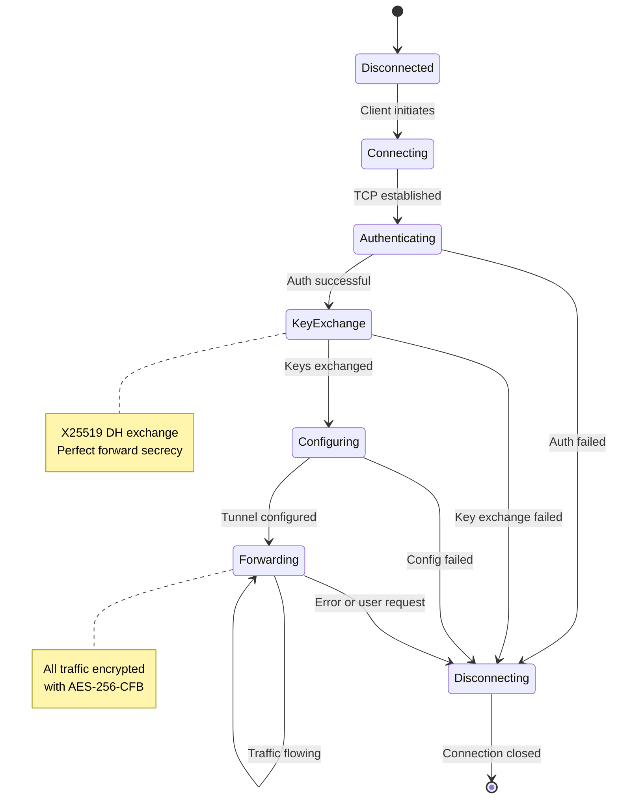

## Network Topology Examples

### Home Network Deployment

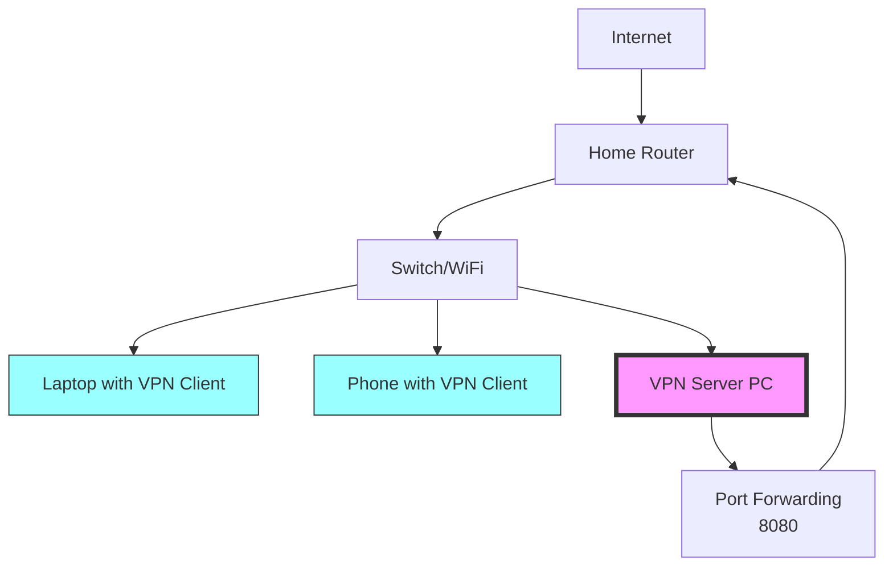

### Cloud VPS Deployment

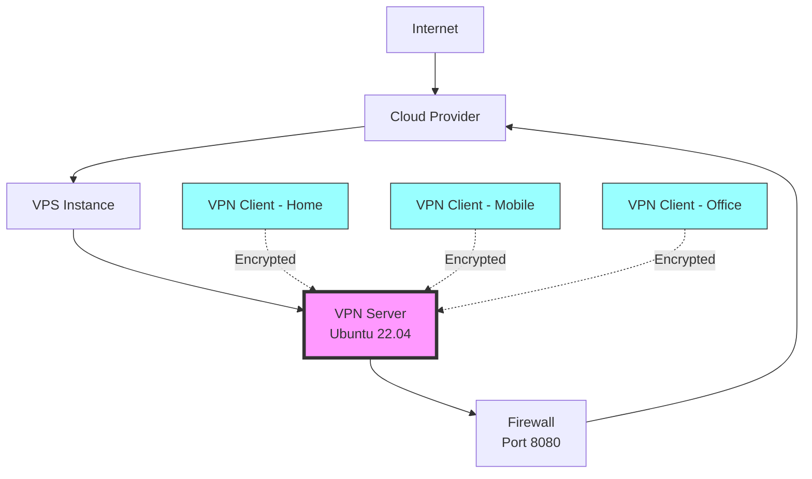

### Corporate HA Deployment

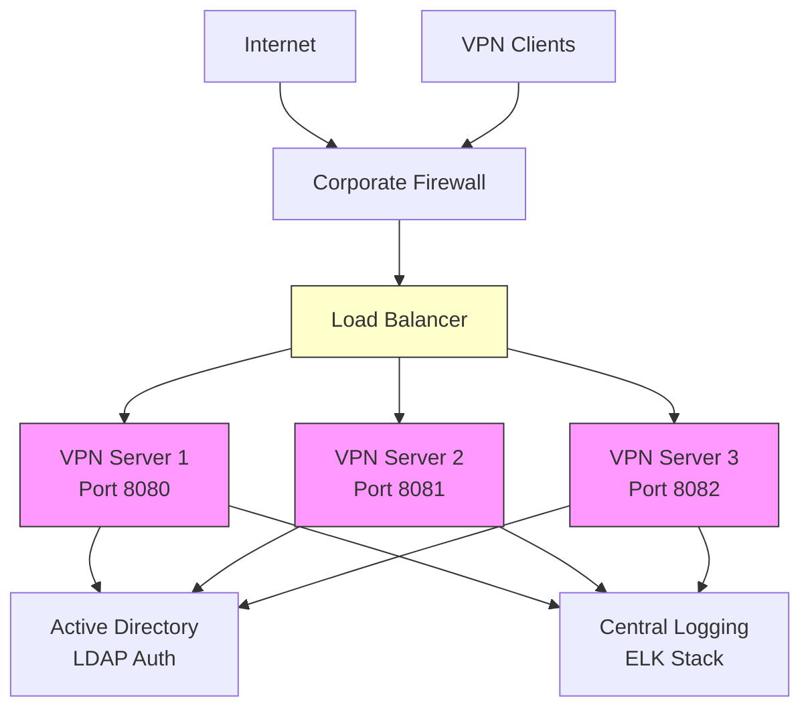

## Security Layers

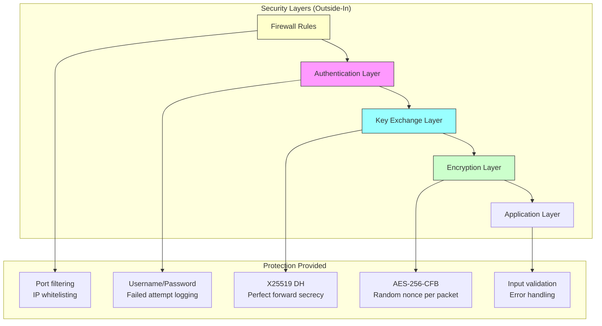

## Performance Characteristics

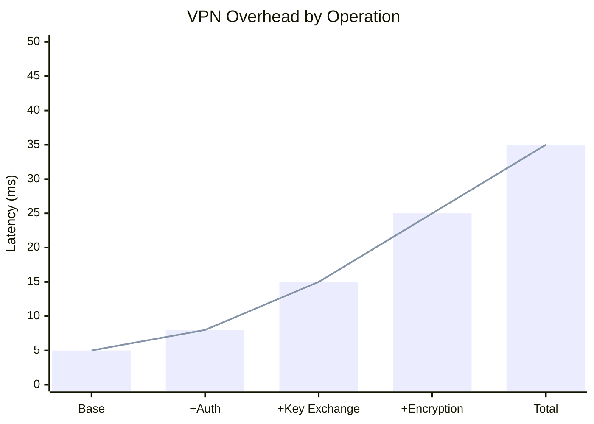

## Comparison with Other VPN Protocols

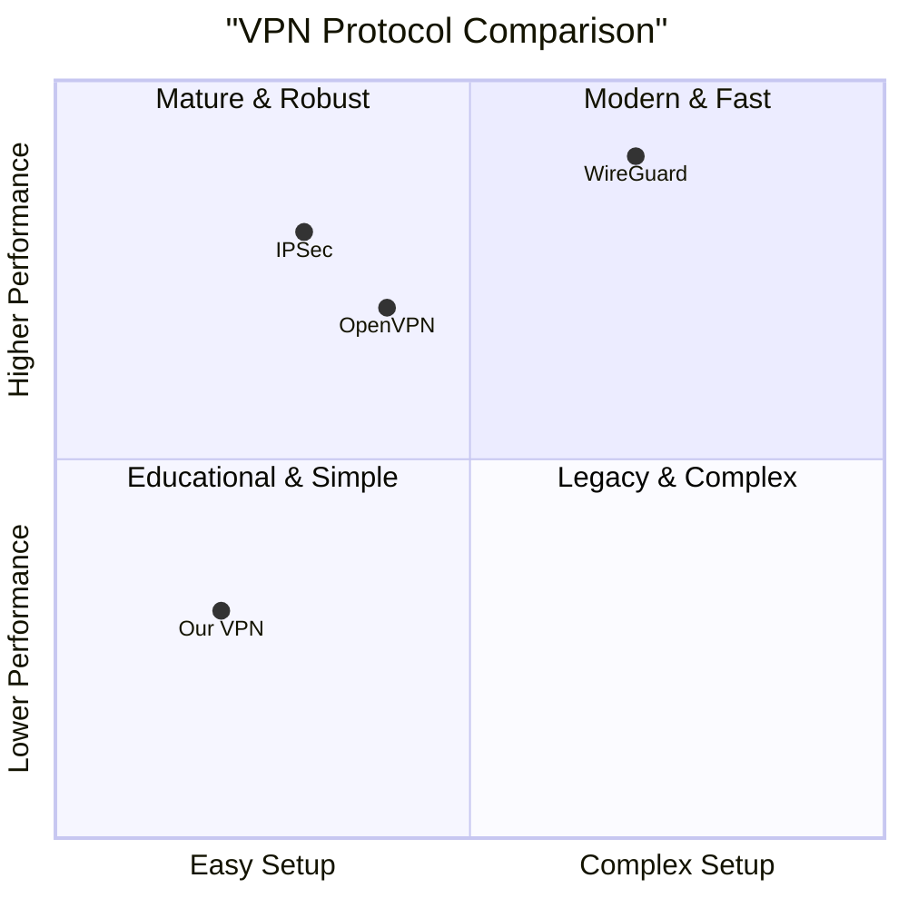

---

**Note:** These diagrams use Mermaid syntax for visualization. View in a Markdown editor that supports Mermaid diagrams for best experience.
